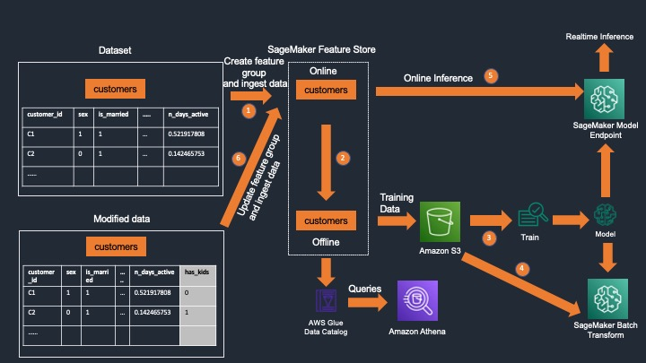

# Amazon SageMaker Feature Store Update Feature Group

[Amazon SageMaker Feature Store](https://docs.aws.amazon.com/sagemaker/latest/dg/feature-store.html) recently introduced the ability to add new features to feature groups. This functionality reduces the overhead of creating and maintaining multiple feature groups. In this post we demonstrate how to add features to a feature group using the newly released [UpdateFeatureGroup API](https://docs.aws.amazon.com/sagemaker/latest/APIReference/API_UpdateFeatureGroup.html).

## Overview
SageMaker Feature Store acts as a single source of truth for feature engineered data that is used in ML training and inference. When we store features in Feature Store, we store them in feature groups. Feature groups can be enabled for offline only mode, online only mode or online and offline modes. Online store is a low latency data store and always has the latest snapshot of the data. Offline store has historical set of records persisted in Amazon S3. Feature Store automatically creates an AWS Glue Data Catalog for the offline store which enables us to run SQL queries against the offline data using Amazon Athena. The following diagram illustrates the process of feature creation and ingestion into Feature Store.

1.	The first step in the process is to define a feature group and create the feature group in Feature Store.
2.	We ingest data into the feature group which writes to the online store immediately and then to the offline store.
3.	The offline store data stored in S3 can be used for training one or more models.
4.	The offline store can also be used for batch inference.
5.	The online store supporting low latency reads can be used for real time inference.
6.	To update the feature group to add a new feature, we use the new SageMaker UpdateFeatureGroup API. This will also update the underlying Glue Data Catalog. Once the schema has been updated, we can start to ingest data into this updated feature group and we can begin to use the updated offline and online store for inference and model training.

In the notebook update_feature_group.ipynb, we demonstrate the following
1. Create a feature group.
2. Ingest initial set of data. We use synthetically generated customer data which is provided in the data folder.
3. Update feature group to add a new feature using boto3 update_feature_group API.
4. Re-ingest data with the new feature included.
5. At the end, we verify the online and offline store for the updates.
